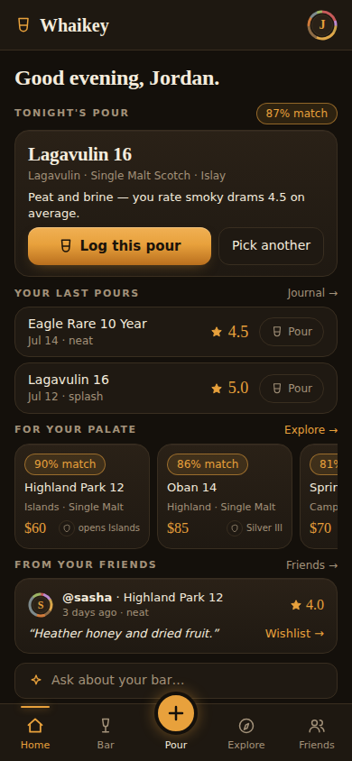
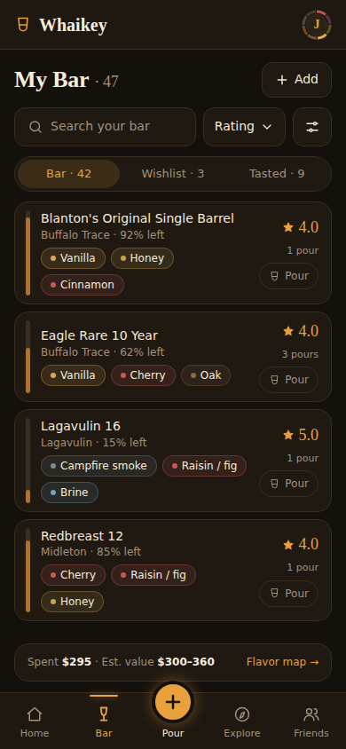
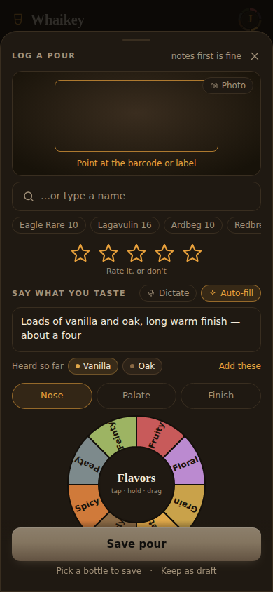
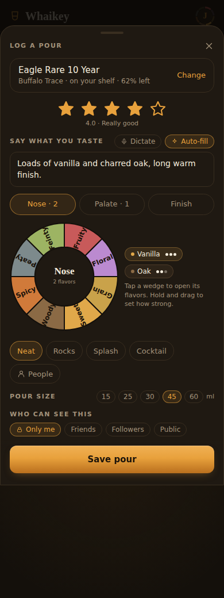
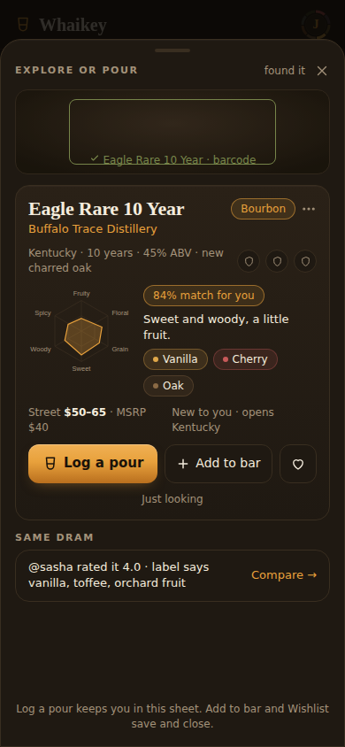
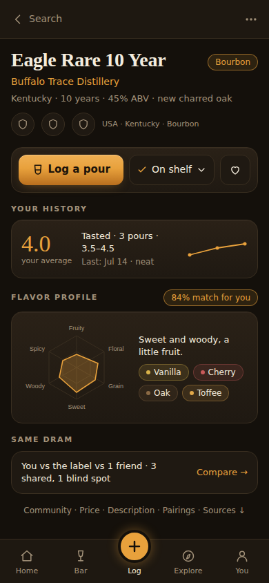
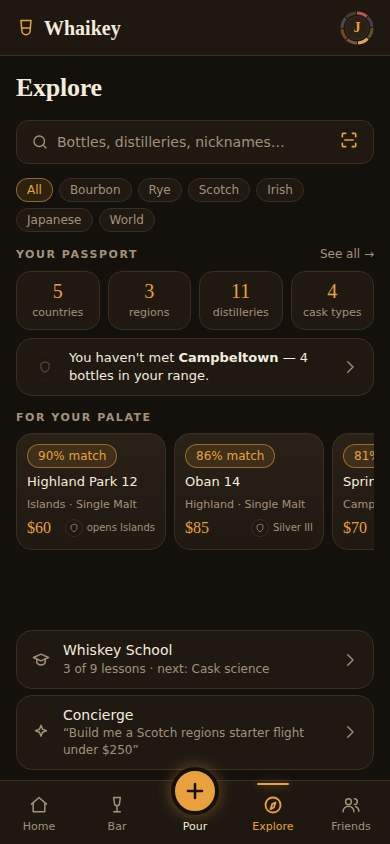
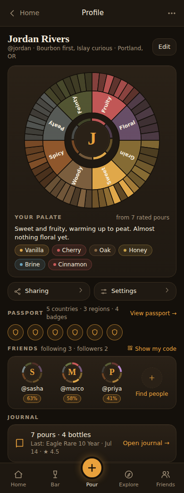
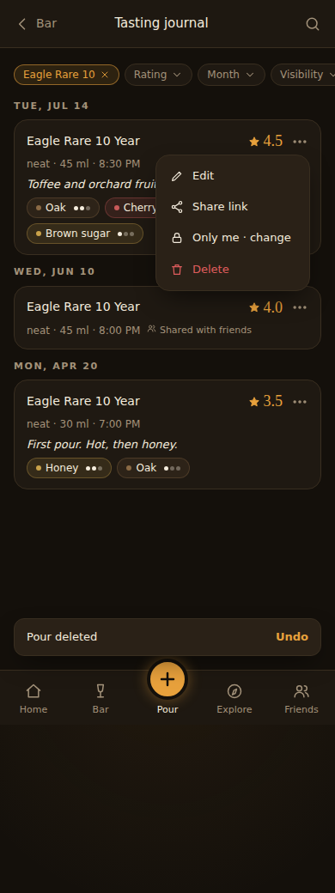
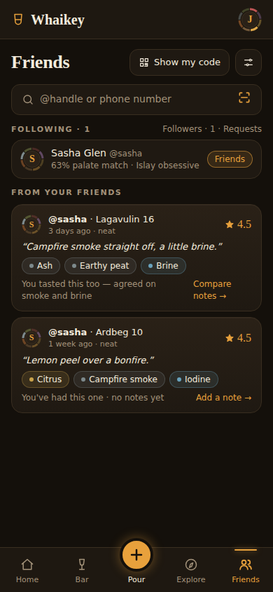

# Whaikey — UX Storyboard (v2, September 2026)

Companion to [PLAN.md](../PLAN.md) §1 and the [September 2026 review](./REVIEW_2026-09.md). This is the target shape of the app's screens and flows after the focus-and-polish pass. It is **binding for UI work the same way DESIGN.md is binding for styling**: a screen that grows past its board here needs the board changed first.

The visual style does not change. DESIGN.md's tokens, recipes and rules all stand. What changes is **priority, density and navigation**: which thing each screen is for, what sits above the fold, and how you get back.

> **v2 (2026-09-03) supersedes v1's nav and several boards after an owner review.** The owner's decisions are collected in §0 so an implementing agent can read them in one place; every board below is already updated to match them. Where v1 proposed something the owner rejected, the rejection is stated so it is not re-proposed.

---

## 0. Owner decisions (read first)

| # | Decision | What it replaces |
|---|---|---|
| D1 | **Bottom nav is Home · Bar · ＋ · Explore · Friends.** The profile ("You") is **not** a tab; it lives behind the **avatar in the top-right of the header** on every tab route. Chat leaves the nav and becomes an affordance (§1.1). | v1's Home · Bar · ＋ · Explore · You |
| D2 | **Home keeps the "For your palate" rail**, and the rail's header links to Explore. Home calls Explore out; it does not absorb it. | v1 moved the rail off Home |
| D3 | **Log a pour is a sheet that opens fully expanded and keeps every piece of the current pour page's richness**: say-what-you-taste + dictate + auto-fill, nose/palate/finish, the interactive flavor wheel with tap-and-hold-and-drag intensity, serving, size, people, visibility. Nothing is hidden behind a disclosure. | v1's minimal "stars + Save + Add detail" sheet |
| D4 | **In the pour sheet you can start taking notes before choosing a bottle; the bottle is required before Save.** | v1 required the bottle first |
| D5 | **Bottle selection starts with scan**, in a compact viewfinder, with an obvious way to type directly beneath it. The current full-page scan screen is too big for this job. | v1's search-first picker |
| D6 | **＋ means "explore or pour a bottle."** Scanning a bottle you are holding (at a store, at a friend's) shows an immediate **bottle breakdown** card, from which you can log a pour, add it to your bar, wishlist it, or just look. | v1's "＋ opens the pour sheet, scan is a fallback" |
| D7 | **Keep the current profile page's structure**, condensed at the top: **place the avatar in the centre of the palate wheel** and **decorate the avatar with a slim colour-coded intensity ring** made from the palate; put a one-line description and the signature-descriptor chips with the wheel. Settings and sharing controls stay in the profile. (Wheel size and the month block are settled by D12.) | v1's "You" hub |
| D8 | **Passport, Journal and Friends appear in the profile as summaries with a link to the full page.** The passport summary shows earned crests **and the next unearned ones greyed beside them**. | v1's plain list rows |
| D9 | **Keep the existing journal design.** Add the ⋯ menu per row (Share and Visibility move into it), keep filters at the top, and make the journal **deep-linkable by bottle**. The **"shared with friends" label on a row is good**; visibility gets **quick-select tags in the pour sheet**. | v1's redrawn compact journal |
| D10 | **Explore is a dedicated tab**, and Home links to it. | (agreed with v1) |
| D11 | **The palate ring on avatars has eight equal segments, one per flavor family, each faded toward the track when that family is not part of the person's palate.** Intensity is encoded by fade, not by segment length. | v2's first draft, which varied arc length |
| D12 | **The profile shows the full two-tier palate wheel** (as today), with the ring avatar in its centre and the description and signature-descriptor chips beneath it. **"This month" stays on the Home dashboard as it is now**; it is not a profile block. | v2's first draft, which shrank the wheel and moved the month review to the profile |
| D13 | **Profile order:** identity → palate card → **Sharing · Settings** → **Passport (earned crests only, no greyed "next")** → **Friends card** (several friends with ring avatars) → **Journal card** (one card, "Open journal →"). | D8's greyed next crests and the two-row journal summary |
| D14 | **The bottle breakdown card has a ⋯ menu** for everything beyond Log a pour · Add to bar / On shelf · Wishlist: edit shelf details, mark finished, remove, share, compare, report a catalog error. Same menu behind the bottle page header ⋯. | — |
| D15 | **Friends page:** no "Find people / How you're found" tabs. One search field with a **scan-code button at its end**; **Show my code** to the right of the "Friends" header (and on the profile's Friends card); **How you're found** behind a settings icon on Friends and under Profile → Settings → Privacy. | v2's first Friends board |
| D16 | **The camera stays live in the pour sheet's bottle slot while you log** (thumbnail beside the bottle row once identified, so you can snap the glass or label) and **pauses automatically after ~2 minutes**. A captured photo attaches to the pour. | — |
| D17 | **The flavor wheel in the sheet is the app's existing `FlavorWheelInput`, unchanged.** The board's wheel drawing is a stand-in. | the board's simplified wheel |
| D18 | **Pour size keeps today's slider, made sleeker** (thinner track, smaller tick labels, value in the section label). | v2's chip row |
| D19 | **Default pour visibility is Friends** for new accounts. "Who can see this" collapses under a **More ▾** disclosure at the bottom of the sheet. | Only me default; visibility as a top-level row |
| D20 | **A Tags row sits directly under pour size** with quick-select tags (Campfire · Dinner · With friends · Tasting · …) plus "+ add". The free-text People field moves under More ▾ as "With…". Tags are private pour data stored in `pours.context.tags`. | the People chip in the serving row |
| D21 | **My Bar keeps the live page's structure over the board's**, with these changes: a much slimmer top (compact stats line, flavor map collapsed to one line with "Open flavor map →"), a slimmer fill spine, a **Pour** quick action per row, plus sort and shelf search. First bottle visible without scrolling. | v2's Bar board as a whole |

The round-3 brief with before/after screenshots and action items per area is [docs/plans/2026-09-ux-refinement-brief.md](./plans/2026-09-ux-refinement-brief.md).

Open questions the owner has not decided (implementing agent: pick the recommended default, flag it in the PR):

| Q | Question | Recommended default |
|---|---|---|
| Q1 | Does ＋ open the pour sheet directly, or a two-choice sheet (Pour · Add to bar)? | **Directly.** The bottle breakdown card (§3.4) offers Add to bar and Wishlist, so a second menu is redundant. |
| Q2 | If the pour sheet is swiped down with content in it, is the draft kept? | **Kept**, as a "Resume your pour" pill above the nav for 24 h; one draft at a time. This is what makes "notes before bottle" safe. |
| Q4 | Does the Friends tab hold the full friends feed, or does the feed stay a Home module? | **Both**: Home keeps the 3-item module; the Friends tab has the full list beneath the people controls. |
| Q5 | Does the batch "Scan your shelf" mode survive? | **Yes**, reached from Bar → **+ Add**, redesigned as a viewfinder-first screen (§3.9). It is for shelving many bottles; ＋ is for one. |

---

## Boards at a glance

Each board is one 390-wide viewport (844 tall; Home and Profile are shown at their full ~2-viewport scroll height), rendered from the app's own tokens and recipes. The primary action of every screen is above the fold.

| Home (scrolls to ~2 viewports) | Bar | Pour sheet (empty) | Pour sheet (filled) |
|---|---|---|---|
|  |  |  |  |

| Bottle breakdown (from a scan) | Bottle | Explore | Profile |
|---|---|---|---|
|  |  |  |  |

| Journal | Friends |
|---|---|
|  |  |

---

## 1. Information architecture

### 1.1 Bottom nav (D1)

| Slot | Label | Verb (PLAN.md §1) | Holds |
|---|---|---|---|
| 1 | **Home** | orientation | Month in review (as today) · Tonight's pick · last pours · **For your palate** (→ Explore) · From your friends · concierge input |
| 2 | **Bar** | Track | The shelf, first. Search/sort/filter in one line. Flavor map behind one tap. **+ Add** (batch scan / search / import) in the header |
| 3 | **＋** | Track + Explore | Opens the **pour sheet**, fully expanded, with the scan-first bottle slot at the top. Scanning an unknown bottle shows the **bottle breakdown** card (§3.4): pour it, add it, wishlist it, or just look |
| 4 | **Explore** | Explore + Learn | Catalog search (with a scan button) · Passport · "For your palate" · Whiskey School |
| 5 | **Friends** | Share | Find people · following / followers / requests · the full friends feed · comparisons |

**Header**: on tab routes, wordmark left, **avatar right → Profile** (`/u/[handle]`, or the profile-claim flow when no handle exists). On non-tab routes: **← back** (labelled with where you came from) · page title · one contextual action. Search and the journal icon leave the header: search lives in Explore and Bar, the journal is reached from Home ("Journal →"), the profile and the bottle page.

**Chat** is an affordance, not a tab: an "Ask about your bar…" input at the bottom of Home, "Ask about this bottle" on the bottle page, and a Concierge row in Explore. All open `/chat`. When AI is not configured they are hidden; the developer setup card never appears in navigation.

The header and the nav are hidden on `/sign-in`, `/welcome` and `/s/[code]`. Every non-tab route has back, and the iOS shell enables swipe-back.

### 1.2 Global patterns (build once, use everywhere)

| Pattern | Rule |
|---|---|
| **Toast with undo** | Every reversible mutation (log a pour, add/remove a bottle, delete a pour, change visibility, revoke a link) confirms with a 4-second toast carrying **Undo**. The scan screen already does this; promote it to an app-level region. |
| **Optimistic writes** | Shelf and journal mutations render immediately and reconcile; errors roll back into the toast. |
| **Sheets over pages for short tasks** | The pour sheet, shelf-detail edits, and the share sheet are bottom sheets so the user never loses their place. Drag handle, `useScrollLock`, one primary button in a sticky footer. |
| **One bottle picker** | `<BottlePicker>`: compact viewfinder on top (barcode loop + label ID), a text field directly beneath, recent bottles as chips. Used in the pour sheet, Bar → Add, Explore's scan button and first run. `<BottleSearch>` (the text half) is the only search UI; the door label says what picking does. |
| **One bottle row** | `<BottleRow>` with `leading`, body, `trailing` slots and `compact`/`default` density. Replaces the six anatomies. |
| **One breakdown card** | `<BottleBreakdown>`: the immediate "what is this and what is it to me" card shown after a scan or search pick, with the four actions. Also the top of the bottle page. |
| **Destructive = confirm or undo** | Never both absent. |
| **Loading, error, not-found** | `loading.tsx` skeletons for Home, Bar, Bottle, Journal, Profile; a root `error.tsx` and `not-found.tsx`. A tab tap paints within 100 ms. |
| **Copy** | One name per thing: *My Bar*, *Journal*, *Concierge*, *Log a pour* (verb) and *Save pour* (button). First-use glosses for blind spot, signature, calibration, Same Dram, taste twin. |
| **Type floor** | 12 px minimum; muted text at full `--muted`. |

---

## 2. Core flows (target tap counts)

| Flow | Today | Target |
|---|---|---|
| Log a pour of a bottle in front of you (＋) | 5 taps + scroll | **＋ → point camera (auto-identifies) → star → Save = 3 taps**, no typing |
| Log a pour from Home's tonight card or a Pour button | 3 taps + ~1,300 px scroll | **tap → star → Save = 3 taps**, no scroll (bottle prefilled; rating is directly under it) |
| Start notes at a tasting before you know the bottle | impossible | ＋ → type or dictate → tap the wheel → scan the label when you can → Save |
| At a store: what is this bottle? | search → bottle page → scroll | **＋ → point camera → breakdown card** (1 tap + camera) |
| Add a bottle from search | 3 taps + ~2,500 px scroll | Explore → result → **Add to bar** on the breakdown card = 3 taps |
| Edit, share or delete a pour | impossible / stacked controls | row **⋯** → Edit / Share / Visibility / Delete (undo) = 2 taps |
| Journal for one bottle | impossible | bottle page "All 3 pours →" or Bar row → `/history?bottleId=` |
| Profile | header avatar (only when a handle exists) | header avatar, always |
| Sign out / settings / export | impossible | Profile → Settings |
| First run → one bottle on the shelf | 8 taps, phone number on screen 3 | sign in → scan or type → tap result → Home = **4 taps** |

### 2.1 First run

1. **Sign-in**: wordmark, one line, Google / Apple. No nav, no header.
2. **Your first bottle**: the `<BottlePicker>` full-screen (viewfinder on top, type beneath). Tapping a result adds it with an undo toast. Skippable.
3. **Home**, with the tonight card pointing at that bottle.

Handle and friends are **not** in first run (SOCIAL.md §7.1: handle at first social action). The "You're set" interstitial is deleted. `/welcome` shrinks to step 2.

### 2.2 The pour sheet (D3, D4, D5)

The sheet opens **fully expanded** from ＋, from any Pour button, from the tonight card and from the bottle page, and returns you where you were. It is the current pour page's content, reordered, in a sheet. Section order, top to bottom:

```
┌────────────────────────────────────┐
│ ─── handle           Log a pour   ✕│
│ ┌──────────────────────────────┐   │  1. BOTTLE SLOT — empty state:
│ │ ▣ compact viewfinder (150px) │   │     live barcode loop + label ID
│ └──────────────────────────────┘   │     "or type a name" field under it
│ 🔍 or type a name…                 │     recent bottles as chips
│ [Eagle Rare 10] [Lagavulin 16] …   │     filled state: bottle row + Change
│                                    │
│ ☆ ☆ ☆ ☆ ☆                         │  2. RATING (optional)
│                                    │
│ SAY WHAT YOU TASTE     🎤 Dictate  │  3. FREEFORM + AI (unchanged)
│ ┌──────────────────────────────┐   │     Auto-fill from notes → chips,
│ │ Loads of vanilla and oak…    │   │     rating suggestion, N/P/F split
│ └──────────────────────────────┘   │
│ Heard so far ● Vanilla ● Oak  Add  │
│                                    │
│ Nose · Palate · Finish             │  4. THE WHEEL (unchanged, full width)
│        ╭────────╮                  │     tap a wedge → leaves; hold → intensity;
│       │  wheel   │                 │     drag; the signature interaction
│        ╰────────╯                  │
│ Neat  Rocks  Splash  Cocktail      │  5. SERVING
│ Pour size · 45 ml  ──────●──────    │  6. SIZE — today's slider, sleeker (D18)
│ Tags  Campfire · Dinner · With friends · +  │  7. TAGS quick-select (D20)
│ More ▾  Who can see · Friends ▾ · With… · Photo │  8. MORE (visibility defaults to Friends, D19)
├────────────────────────────────────┤
│ [        Save pour         ]       │  sticky footer; disabled until a bottle is set,
│  Pick a bottle to save · Discard   │  with the reason shown inline
└────────────────────────────────────┘
```

Rules:
- **Everything is visible; nothing is behind a disclosure.** The sheet scrolls; the footer is sticky.
- **Order is bottle → rating → words → wheel (the app's own, D17) → serving → size → tags → More.** The bottle slot is first because it is the one required thing, but it does not block anything below it: you can type, dictate, tap the wheel and rate with the slot still empty (D4). Save stays disabled with "Pick a bottle to save" until it is filled; ✕ or swipe-down with content keeps a draft (Q2).
- **Scan is the default way to fill the slot** (D5): the viewfinder is live as soon as the sheet opens (permission already granted) and about 150 px tall; a barcode hit or a confident label match fills the slot with a toast and an Undo; the text field is directly beneath for typing; recents are one tap. When a bottle is prefilled (Pour button, tonight card), the slot renders as a bottle row with **Change**.
- **Scanning a bottle you don't own** swaps the slot for the **bottle breakdown** card (§3.4) with Log a pour / Add to bar / Wishlist / Just looking. "Log a pour" collapses it back to the filled slot and continues in the same sheet.
- **One Save.** The sticky-header Save, the second "Save pour" and "Just drinking? Log without notes" go away. An unrated pour is allowed.
- **After Save**: toast with Undo, sheet closes, you are where you were. The "Poured." page is deleted. Edit reopens the same sheet prefilled.
- Pour size keeps its slider (D18), below the wheel and never larger than the rating. Tags (D20) sit directly under it; the People field and "Who can see this" live under More ▾ with Friends as the default (D19).
- The camera keeps running in the bottle slot while you log and pauses after ~2 minutes (D16); a photo taken there attaches to the pour.

### 2.3 ＋ at a store (D6)

＋ → the sheet opens on the empty bottle slot → the camera identifies the label → the **breakdown card** renders in place: name, distillery, origin · age · ABV · cask, a mini flavor radar with your match %, price shown as a range, your history if any ("You rated this 4.0 · 3 pours"), the passport hook ("opens Islands"), and four actions. From there: **Log a pour** (continue in the sheet), **Add to bar**, **Wishlist**, **Just looking** (closes with nothing saved). The same card is the top of the bottle page and the result of a pick in Explore's search, so the store flow and the shelf flow share one component.

---

## 3. Screen boards

Each board: purpose · primary action · above the fold (390×844) · below the fold · **not here** · states.

### 3.1 Home

- **Purpose**: orient in three seconds; every module answers "what's next?".
- **Primary action**: log tonight's pick.
- **Blocks, in order**: greeting → **Month in review** as today (the sentence and its three tiles; D12) → **Tonight's pour** card (bottle, one-line palate/occasion reason, match chip, `[Log this pour]`, Pick another) → **Your last pours** (three compact rows, one-tap Pour, "Journal →") → **For your palate** rail (three cards: match chip, passport hook; header link **"Explore →"**, D2) → **From your friends** (up to three cards, "Friends →") → concierge input.
- **Not here**: the "what you reached for" bars (→ the flavor map); Running low / Restock (→ Bar filter); the Whiskey School row (→ Explore); the greyed skeleton unlock card.
- **Length target**: ≤ 2 viewports (the rail and friends module are allowed to push it past 1.5). Today: 3.1.
- **States**: no bottles → one card: "Add your first bottle" (scan / type). Bottles but no pours → tonight card says "Pour it when you're ready". No friends → the friends module is absent (the invite lives in Friends).
- **Guardrail**: the tonight reason is palate/occasion only; "only 15 % left — finish it before it fades" is removed. Low fill is a Bar fact.

### 3.2 Bar (D21: the live page's structure, slimmed)

- **Purpose**: find a bottle you own and act on it. The live `/bar` page stays; the board shows only the parts to take from it: a top slim enough that the first bottle is visible without scrolling, a slimmer fill spine, a Pour action per row, sort and shelf search.
- **Header row**: "My Bar · 47" · **+ Add** (opens a small sheet: **Scan your shelf** (batch, §3.9) · Type a name · Import).
- **Above the fold**: control line `[Search your bar] Sort ▾ Filter` → segmented **Bar · Wishlist · Tasted** (Tasted derived from pours) → the shelf list.
- **Row**: fill spine · name · distillery · top three flavor chips · your rating + pour count · a **Pour** button. Tapping the rating/pour count opens `/history?bottleId=` (D9).
- **Footer strip**: `Spent $295 · Est. value $300–360 · Flavor map →`. The flavor map is its own view with every lens and the legend.
- **Filters**: one vocabulary (collection = segmented control; Open/Sealed/Running low, category, region in a bottom sheet). **Sort**: rating · recently poured · recently added · fill · price · name.
- **Not here**: four dollar figures at the top; the wheel above the list; "Weight by rating".

### 3.3 Pour sheet — see §2.2.

### 3.4 Bottle breakdown card (new; D6)

`<BottleBreakdown>` — the "what is this, and what is it to me?" card:
- Name (Fraunces 22), distillery, category chip, origin · age · ABV · cask, and the bottle's **passport crests** (country · region · style, `BottleStamps`) at 34 px.
- Mini flavor radar (~110 px) with the palate-match chip and one sentence ("Sweet and woody, a little fruit").
- Price as a range with source label; your history line if any; the passport hook ("opens Islands · you've met 3 of 6 Scotch regions").
- Actions: `[Log a pour]` primary · `Add to bar` · `♡ Wishlist` · "Just looking" text link. If already on the shelf: `On shelf` replaces Add. A **⋯** in the card corner holds the rest (D14): edit shelf details · mark finished · remove · share · compare · report a catalog error.
- Shown: in the pour sheet after a scan or search pick; as the top block of the bottle page; after a pick in Explore search.

### 3.5 Bottle page

- **Above the fold**: the breakdown card (§3.4) with its action bar sticky.
- **Below**: Your history (average, sparkline, last three, "All N pours →" deep-linking the journal) → Same Dram as one clean sentence + Compare → community rating (≥ 3 public raters only) → description → pairings → sources and reviews last → "Ask about this bottle".
- Shelf details (fill, paid, store, location, notes) open as a sheet from "Edit details". Fill auto-decrements on pours and the sheet says so.
- **Not here**: sources above the fold; an inline edit form; a standalone "I've tried it" button (Tasted is derived).

### 3.6 Explore

- **Above the fold**: search field **with a scan button inside it** (the same `<BottlePicker>` opens) → category chips that wrap → **Your passport** strip (countries · regions · distilleries · casks) with a gap card ("You haven't met Campbeltown — 4 bottles in your range").
- **Below**: **For your palate** rail (full) → Whiskey School row with real progress → Concierge row.
- `/passport` index: countries/regions as territory, distilleries/casks as tiers, the badge wall with unearned crests greyed. No pour counts anywhere.

### 3.7 Profile (`/u/[handle]`; own view from the header avatar; D7, D8)

Keep the current page's structure and copy; condense the identity row and make the wheel the centrepiece.

- **Identity row (condensed)**: name (Fraunces 22) with @handle · bio · location on one muted line beneath; Edit (own) or Follow / Following · Follows you · ⋯ and the match chip (others). No separate avatar here: the avatar is inside the wheel.
- **Palate card**: the **full two-tier palate wheel** (D12) at ~290 px, families inside, all ~55 leaves outside, heat as opacity. In its centre, the **palate ring avatar** at ~88 px. Beneath the wheel: the label "Your palate · from N rated pours", the one-line description ("Sweet and fruity, warming up to peat. Almost nothing floral yet."), and the **signature descriptor chips** (up to six, wedge-coloured).
- **No "This month" block**: the month review belongs to the Home dashboard (D12).
- **Then, in order (D13):** the **Sharing · Settings** row directly under the palate card → **Passport** (earned crests only, "View passport →") → **Friends card** (up to four friends with ring avatars, handle and match chip; "Show my code" and "Find people →") → **Journal card** (count, last pour, "Open journal →").
- **Sharing** (own): shared links count, default visibility → the existing controls. **Settings** (own): account · sign out · rating scale · units · privacy (incl. how you're found) · export · delete.
- **Palate ring avatar** is a shared component used wherever an avatar appears (header, comments, friends, feed) at 28–96 px. Ring = 3–5 px stroke, **eight equal segments** in `flavor-wheel.ts` wedge colours with small gaps; each segment's opacity follows that family's share of the palate vector, from a faint track (~12 %) when absent to full colour at the peak (D11). No ring until the palate has ≥ 3 rated pours; the track alone renders before that.

### 3.8 Journal (`/history`; D9)

Keep the existing design (day groups, cards with serving · size · time, note excerpt, intensity-dotted flavor chips). Changes:
- **Filter line at the top**: Bottle ▾ · Rating ▾ · Month ▾ · Visibility ▾, plus the pour count. `?bottleId=` (already supported) pre-selects the bottle filter and shows a clearable chip.
- **Per-row ⋯ menu**: Edit (opens the pour sheet prefilled) · Share link · Visibility (Only me / Friends / Followers / Public) · Delete (undo toast). The stacked visibility chip and Share button are removed from the card body.
- **Row label**: a small muted "Shared with friends" / "Public" label appears only when the pour is not private (private is the default and needs no badge).
- Deep links: bottle page "All N pours →", Bar row rating, profile Journal summary.

### 3.9 Scan your shelf (batch; Q5)

Reached from Bar → + Add. Redesigned viewfinder-first: the camera fills the screen; the relationship radios (I own it · Tried it · Wishlist) float over the top; manual code entry and "Snap the label" are a compact bottom strip; the session tray is a collapsed chip ("Scanned 4 · Undo last") that expands on tap. "Done → My Bar" stays. Import moves to Bar → + Add and Settings → Data.

The decision sheet for a miss carries **three** ways out, not two: pick from the catalog, snap the label, or **add the bottle right there** (§3.13) — in the sheet, because the queue is the screen's state and leaving loses it.

### 3.10 Friends (tab)

Header row: "Friends" · **Show my code** · settings icon (opens **How you're found**, the existing discovery settings, as a sheet). One search field "@handle or phone number" with the **scan-code** button at its trailing edge (D15). Then Following / Followers / Requests, then the full "From your friends" feed (Q4).

### 3.11 Compare, Note discussion, Learn — unchanged. These remain the reference compositions.

### 3.12 Public share page `/s/[code]` — add the signed-out CTA ("Track your own pours — free") with a return-to-page sign-in.

### 3.13 Adding a bottle the catalog lacks (`/bottles/new`; WP-16)

A miss is an ordinary answer on a catalog this size, so it has somewhere to go. Two required fields — **name** and **category** — and nothing else required; distillery, age and ABV are optional. Arrives pre-filled from whatever the miss already knew (the words typed, the barcode read) and returns to where it came from.

- **Where it is a page**: the search empty state ("Add it yourself" beside "Start over") and, for a signed-out visitor, behind a sign-in that returns to this same pre-filled URL.
- **Where it is *not* a page**: the **batch scanner** and the **import match step** add in place. Both hold their state in the screen — a scan queue, a table of parsed rows — and navigating away to add one bottle throws the rest of it away. Same route underneath, same dedupe prompt, no navigation. This is the "sheets over pages for short tasks" rule (§1.2) with a specific reason attached.
- **Dedupe**: a name already in the catalog comes back as a prompt with the near-matches and a way through it ("None of these — add mine"), because two different bottles can share a name. Looser near-matches are shown and never block.
- **Not here**: photos, ABV/cask/mash detail, distillery creation, anything about the review queue beyond one line of copy. The bottle is the user's immediately and everyone else's once a person has looked at it; the copy says exactly that and promises no date.

### 3.14 Age gate (`/age`) and Drinking responsibly (`/responsible`; WP-17)

**`/age` is a blocking screen and looks like one**: no header, no bottom nav, because every tab behind it redirects straight back to it. One question — where are you, and when were you born — with the minimum for the selected market stated *before* the answer, not after. Asked once per account and kept.

- **Blocked state**: says the date the account becomes eligible, offers the resources page, and offers a **real sign-out** (not a link to `/sign-in`, which leaves the session live). No second attempt at the question.
- **`/responsible`** is an ordinary content page reachable signed-out: what the app will not do, what a pour contains, and named organisations. Linked from the gate, the blocked state, sign-in and `/sharing`. It moves to **Settings → About** when Settings exists.
- **Not here**: identity verification, a re-check at first social action, any claim the app cannot honour today (the export line says it is not built yet, because it is not).


### 3.15 Update required (`/app-update` and the native shell; WP-20)

The screen a bad deploy still renders, and the one an operator sees after raising `WHAIKEY_MIN_SHELL_VERSION` to stop one (docs/NATIVE_APP.md §2.2). Full screen, over everything, **no header and no nav** — every tab behind it leads to a UI this binary cannot run.

- One line saying what happened (overridable per outage by `WHAIKEY_SHELL_NOTICE`), one button to the store when a store URL is configured, and the two version numbers in small text so a support reply has something to go on.
- It must promise nothing about data: "nothing you've logged is lost" is the only reassurance offered, and it is true — the queue is local and survives an update.
- The native shell renders the component inline; `/app-update` renders the same one, which is what gives an outage-critical screen a visual baseline and a link a store listing can use.
- It is **above everything**, the nav's own quick-actions sheet included, and the splash holds until the check settles — revealing a UI the binary cannot run, even for a moment, is the failure this screen exists to prevent.
- It **lifts again** if the floor is lowered: an operator rolling back a mistaken raise should not need the user to kill the app.
- **Not here**: a retry button (there is nothing to retry — the binary is the problem), a way past it, or anything about the deploy that caused it.

### 3.16 Policy and support (`/terms`, `/privacy`, `/support`; WP-18)

Three ordinary content pages, reachable **signed out and un-gated** — a gate that hides the privacy policy from the person deciding whether to answer it is the gate arguing against itself, and a support form that needs a session cannot hear about a sign-in bug.

- **`/terms` and `/privacy`** are one shared composition (`policy-page.tsx`): a title, an effective date when there is one, prose sections, and a footer linking the other two. They are long by nature, so they are the one place in the app where a wall of text is the right answer.
- **The unfinished banner** is the only unusual element: while the legal entity, jurisdiction or contact address are unset, the page opens with a visible notice saying so. It is not a soft "coming soon" — the point is that a policy which *looks* finished and names nobody is worse than one that admits it. It disappears when the environment supplies all three.
- **`/support`** is a form and three lines of orientation: what to write about here, what the GitHub issue form is for (catalog corrections), and the responsible-drinking link. One textarea, one optional contact field, one button; app version and platform are attached silently.
- **Not here**: an account or a sign-in requirement, a ticket number, a promised response time the product cannot keep, chat, or an FAQ nobody has written.

### 3.17 Operator screens (`/admin/reports`, `/admin/submissions`; WP-18)

**Deliberately outside the design system, and outside the nav.** They are internal tools for one person: no bottom nav, no header, no brand, nothing that needs a visual baseline. The only visual work is making a breached SLA impossible to skim past and the destructive action hard to mis-tap. They are **404 for everyone who is not an operator** — not 403, which would confirm they exist.

- **`/admin/reports`**: open reports oldest first, each with enough of the subject to judge it without leaving the page — **the subject as it read when it was reported**, and, only when the two differ, what it says now under an "Edited since it was reported" flag. The snapshot is the primary text and the current version is the annotation, because an operator judging an edited comment against its current wording is judging the wrong thing: the edit is often the response to being reported, and without a snapshot rewriting the abuse is a complete defence. A report filed before snapshots existed says so rather than passing the current text off as the original. The "now" half is withheld entirely when the subject has been deleted, made private, or its author has stepped back — the row says which, and is not flagged edited, because a revision written after the content went private was never shared with anyone and the "not here" rule below covers it. Then its age in hours (red past 72), who reported it, and whether it is already handled. One free-text reason per row, **required for every action without exception** — hide, unhide, suspend, reinstate and dismiss alike, with each control disabled until it is typed. The trail is a record of decisions rather than of sanctions, and the entries somebody comes back about are as often "why was my report dismissed" or "why was this put back" as "why was it taken down". The reported text is shown **in full**, scrolled rather than trimmed: there is no expansion control and no link to the content, so anything cut here is something the operator can never read. Then Hide / Suspend author / Reinstate / Dismiss. **Suspending from a comment or pour report takes that subject down with the account**, in one transaction: the two were otherwise mutually exclusive, since whichever was clicked resolved the report and removed the only row carrying the subject's id — leaving the reported content to return the moment the account was reinstated. **Hide stays available on a subject that is already hidden**, and **Suspend on an author already suspended**, reading "Resolve as hidden" and "Resolve as suspended" — several people reporting one comment is the ordinary case, and the later reports are genuinely handled by the hide in force; disabling either would leave them closable only by dismissing real complaints as unfounded — or, for a profile report, by *reinstating* the account to close a report that agreed with the sanction. **Suspend survives the subject's deletion**, because the report records its author: removing the content is not an answer for having posted it. **Hide is absent on a profile row**: a profile's only lever is a switch in the account's own settings, so the button would promise an action that does not stick. There, suspension is the action.

  Beneath the queue: **Suspended accounts** and **Hidden right now**, both paged oldest-cursor-first, because they carry the only reinstate and lift controls in the product and a bounded history list would silently drop the oldest decisions out of reach. Then recent actions, which is history — the audit trail an appeal is answered from, with no controls of its own.
- **`/admin/submissions`**: bottles waiting to enter the shared catalog, oldest first, each showing, inline, every fact a review needs: category, distillery (matched, or typed-and-unmatched), origin, ABV, barcode, where it came from, who sent it. **No link to the bottle**: `/bottles/[id]` is 404 for anyone but the submitter while a bottle is pending, and the operator is deliberately not an exception to that rule — so the row carries the facts instead of pointing at a page that would fail. Add to catalog / Decline (reason required) / Mark duplicate (needs the id of a bottle that is already public). A submission the reviewer made themselves is labelled, not blocked — with one operator, blocking it means their own bottles never get in.
- **Not here**: bulk actions, editing a submitted bottle's fields, merging a duplicate's shelf rows and pours (that is a data migration, not a moderation action), user search, or any view of a user's private journal. An operator can hide a thing and suspend an account; they cannot read what was never shared.
- **`/admin/feedback`**: what came through `/support`, outstanding first and oldest-outstanding first, each row markable handled once. The three operator screens link to each other and to nothing else in the app.
- **Both queues are bounded and say so.** One page, oldest first, with the true open/pending count in the header and "showing the N oldest" when there are more. A queue that renders its whole backlog fails in the one situation it exists for.
- **What the submitter sees instead**: the outcome, on the bottle's own page (`submission-status.tsx`) — waiting, declined with the reason as written, or pointed at the bottle it duplicates. Approved says nothing, because being in the catalog *is* the outcome.

---

## 4. Guardrail-sensitive UI

| Shipped today | Board says |
|---|---|
| "Running low · Restock" card on Home | Low fill is a Bar filter and a row fact; no Home card |
| "Only 15 % left — a good one to finish before it fades" | Reason lines are palate/occasion only |
| One-tap Pour with no confirm or undo | Keep one-tap re-pour with an undo toast; never a push or badge |
| Pour-size slider above the fold, larger than the rating | Compact chip row below the wheel |
| Four dollar figures at the top of My Bar; "est. value" as a point | Footer strip; value as a range with a source label |

---

## 5. Migration notes for the implementing agent

Order of operations that keeps every step shippable and visually baselined. Each step ships with regenerated baselines per DESIGN.md and is reviewed against the **Not here** lists above.

1. **Global** (no IA change yet): `AppNav` hidden on `/sign-in`, `/welcome`, `/s/[code]`; header back slot on non-tab routes; iOS swipe-back; app-level toast+undo; `loading.tsx` / `error.tsx` / `not-found.tsx`; `Promise.all` the page waterfalls.
2. **`<BottlePicker>`** (compact viewfinder + type + recents), built from the scan client's engine (`useScanEngine` extracted from `scan-client.tsx`) and the existing search API. Replace the pour flow's picker and `/welcome`'s step with it.
3. **Pour sheet**: move `pour-flow.tsx`'s content into a full-height sheet component in the order of §2.2; bottle-optional-until-save; one sticky Save; draft persistence; visibility quick tags; delete the celebration page; return to origin. Wire Edit from the journal ⋯ menu to the same sheet.
4. **`<BottleBreakdown>`**: extract from the bottle page hero + shelf actions; use it in the sheet after a scan/pick, at the top of the bottle page, and in Explore results. Drop the standalone "I've tried it".
5. **Journal**: ⋯ menu wired to `PATCH`/`DELETE /api/pours/[id]`; filter line; visibility label; deep links from Bar and bottle page.
6. **Bar**: shelf first; search + sort; one filter vocabulary; `+ Add` sheet; flavor map to its own view; money to the footer range.
7. **Profile**: palate ring avatar component; condensed top card; passport/journal/friends summaries with greyed next crests; settings section with sign-out, export, delete (`/api/account/*`).
8. **IA**: nav becomes Home · Bar · ＋ · Explore · Friends; header avatar → profile everywhere; Explore page with `/passport` index and counters; Home per §3.1 with the rail linking to Explore; Chat demotes to affordances. Regenerate all baselines in one PR; update SOCIAL.md §6.1/§6.3.
9. **Batch scan** redesign (viewfinder-first) and **first run** shrink.
10. **Components**: `<BottleRow>` replaces the six row anatomies; copy pass; type floor.
