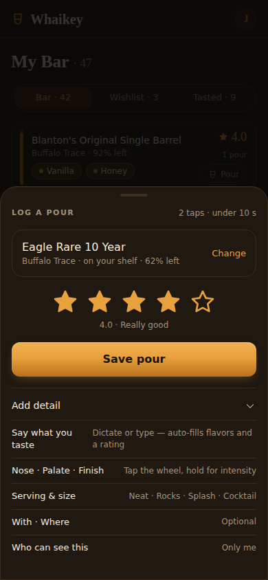
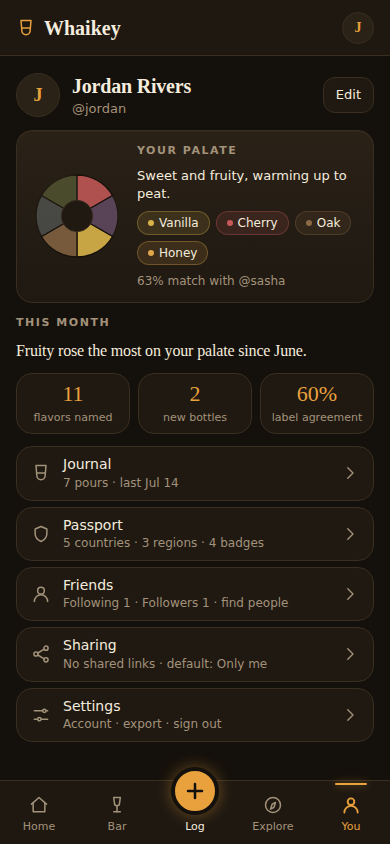

# Whaikey — UX Storyboard (September 2026)

Companion to [PLAN.md](../PLAN.md) §1 and the [September 2026 review](./REVIEW_2026-09.md). This is the target shape of the app's screens and flows after the focus-and-polish pass. It is **binding for UI work the same way DESIGN.md is binding for styling**: a screen that grows past its board here needs the board changed first.

The visual style does not change. DESIGN.md's tokens, recipes and rules all stand. What changes is **priority, density and navigation**: which thing each screen is for, what sits above the fold, and how you get back.

---

## Boards at a glance

Each board is one 390×844 viewport, rendered from the app's own tokens and recipes. The primary action of every screen is above the fold. An editable canvas version of these boards was published alongside the September 2026 review; the renders below are the reference.

| Home | Bar | Log a pour (sheet) | Bottle |
|---|---|---|---|
|  |  |  |  |

| Explore | You | Journal |
|---|---|---|
|  |  |  |

---

## 0. The diagnosis in one paragraph

The app is not clunky because screens are unfinished. Each screen is well crafted. It is clunky because the four highest-traffic screens (Home, My Bar, Log a pour, Bottle) are two to three and a half viewports long with their primary action at the bottom; because the bottom nav spends two of five slots on the two thinnest surfaces (Friends, Chat) while Explore, Learn, Search and the Journal have no home; because there is no way back, no edit, no delete, no settings and no sign-out; and because the same job is drawn several different ways (three search UIs, six bottle-row anatomies, two sharing controls per journal row). The three screens that already work (Learn hub, Compare, Note discussion) are one screen, one action, one payoff. That is the target for everything else.

---

## 1. Information architecture

### 1.1 Bottom nav: one slot per verb

| Slot | Label | Verb (PLAN.md §1) | Holds |
|---|---|---|---|
| 1 | **Home** | orientation | Tonight's pick · last pours · one thing from friends or discovery |
| 2 | **Bar** | Track | The shelf, first. Search/sort/filter in one line. Flavor map behind one tap. **+ Add** in the header |
| 3 | **＋** | Track (the core loop) | Opens the **pour sheet** directly, not a menu. The sheet's first step already offers scan, search and recents |
| 4 | **Explore** | Explore + Learn | Catalog search · Passport · "For your palate" · Whiskey School |
| 5 | **You** | Refine + Share | Palate card · Journal · Month in review · Friends and feed · Sharing · Settings |

What leaves the nav: **Friends** becomes a section of You (the tab is a near-empty room until the graph is dense; SOCIAL.md §6.3's tripwire has not fired). **Chat** becomes a persistent affordance rather than a destination: an "Ask about your bar" input on Home, "Ask about this bottle" on the bottle page, and a Concierge row in Explore. `/chat` remains as the full conversation view those entry points open. When AI is not configured, the affordances are hidden entirely; the developer setup card never appears in production navigation.

### 1.2 Header

Three slots: **leading**, **title**, **trailing**.

- On a tab route: wordmark · (nothing) · avatar → You.
- On any other route: **← back** (labelled with where you came from when known, else the parent tab) · page title · one contextual action (e.g. Share on a note, ⋯ on a bottle).
- Search and Journal leave the header; they live in Explore and You.
- The header and the bottom nav are both hidden on `/sign-in`, `/welcome`, and `/s/[code]`.

Back is a **first-class requirement**: every non-tab route has a back affordance, and the iOS shell enables swipe-back (`allowsBackForwardNavigationGestures`).

### 1.3 Global patterns (build once, use everywhere)

| Pattern | Rule |
|---|---|
| **Toast with undo** | Every mutation that can be undone (log a pour, add/remove a bottle, delete a pour, change visibility, revoke a link) confirms with a 4-second toast carrying **Undo**. The scan screen already implements this; promote it to an app-level region. |
| **Optimistic writes** | Shelf and journal mutations render immediately and reconcile; errors roll back into the toast. |
| **Sheets over pages for short tasks** | Logging a pour, editing shelf details, sharing, and the ＋ actions are bottom sheets so the user never loses their place. Sheets use `useScrollLock`, a drag handle, and a single primary button. |
| **One search component** | `<BottleSearch onPick doorLabel />` is the only search UI. The door label says what picking does ("Log a pour", "Add to bar", "View"). Used in Explore, the pour sheet, Bar → Add, and first run. |
| **One bottle row** | `<BottleRow>` with `leading` (fill spine / shot / crest), body (name, distillery, one meta line), `trailing` (rating / price / action). Density variants `compact` and `default`. Replaces the six anatomies. |
| **Destructive = confirm or undo** | Never both absent. Remove-from-shelf and delete-pour get undo; delete-account gets typed confirmation. |
| **Loading, error, not-found** | `loading.tsx` skeletons for Home, Bar, Bottle, Journal; a root `error.tsx` and `not-found.tsx`. A tab tap must paint something within 100 ms. |
| **Copy** | One name per thing: *My Bar* (not Mine/your shelf), *Journal* (not history/tasting journal), *Concierge* (not chat), *Log a pour* (the verb) and *Save* (the button). Jargon gets a first-use gloss: "blind spot: the label names it, you didn't". |
| **Type floor** | 12 px minimum; muted text at full `--muted`, never `/50`–`/80` opacity variants. |

---

## 2. Core flows (target tap counts)

| Flow | Today | Target |
|---|---|---|
| First run → one bottle on the shelf | 8 taps, 6 screens, phone number asked on screen 3 | **4 taps**: sign in → scan or search → tap a result → Home |
| Log a pour (from Home's tonight pick) | 3 taps + ~1,300 px scroll to reach the stars | **2 taps, no scroll**: tap card → tap star (auto-saves, undo toast) |
| Log a pour (from ＋) | 5 taps + scroll | **3 taps**: ＋ → recent bottle → star |
| Add a bottle from search | 3 taps + ~2,500 px scroll to "I own it" | **3 taps, no scroll**: Explore → result → "Add to bar" in the sticky action bar (or inline on the result) |
| Edit or delete a pour | impossible | **2 taps**: row ⋯ → Edit / Delete (undo) |
| Share a pour | two unrelated controls per row | **2 taps**: row Share → sheet (who can see + get a link) |
| Sign out | impossible | You → Settings → Sign out |
| Find the Passport | profile only, via a crest | Explore tab, second block |

### 2.1 First run (storyboard)

1. **Sign-in** — wordmark, one line of promise, Google / Apple. No nav, no header. (`signed-out-sign-in.png` minus the bottom nav.)
2. **Your first bottle** — the full-screen search with the scan button on top. "Whatever's on your shelf, or the one you're wishing for. One is plenty." Tapping a result adds it to the bar with an undo toast and advances. Skippable.
3. **Home**, with the tonight card already pointing at that bottle: "Pour it when you're ready."

Profile handle and friends are **not** in first run. The handle is claimed at the first social action (SOCIAL.md §7.1). Friends are offered from You, and from the first shared link. The "You're set" interstitial is deleted. Target: under 60 seconds and one bottle. The `/welcome` wizard shrinks to step 2 above.

### 2.2 Log a pour (storyboard)

The pour sheet slides up from wherever you are and returns you there.

```
┌──────────────────────────────┐
│ ─── handle                   │
│ Eagle Rare 10 Year    Change │  ← prefilled from context, or step 0 (search/scan/recents)
│                              │
│   ☆   ☆   ☆   ☆   ☆          │  ← thumb-sized; tapping a star enables Save
│                              │
│ [        Save pour        ]  │
│                              │
│ Add detail ▾                 │  ← ONE disclosure; everything below is optional
│   Say what you taste  🎤     │
│   Nose · Palate · Finish     │
│   Flavor wheel               │
│   Neat · Rocks · Splash …    │
│   Pour size (default hidden) │
│   With · Where               │
│   Who can see this  🔒       │
└──────────────────────────────┘
```

- Exactly one Save. The sticky-header Save and "Just drinking? Log without notes" are removed; an unrated pour is allowed (Save is enabled once a bottle is chosen) and the toast says "Poured · no rating yet · Undo".
- After Save: toast, sheet closes, you are where you were. The "Poured." celebration page is removed. The journal row is the record and can be enriched later.
- Pour size lives inside the disclosure and defaults silently. It is never larger on screen than the rating. (Volume is a private detail, not a headline.)
- Dictate and Auto-fill stay, inside the disclosure, as the first row: they are the AI-native path and must remain one tap from the stars.

### 2.3 Add a bottle

- **From Explore search**: results carry an inline **+** that opens a 3-option mini-sheet (Add to bar · Wishlist · Log a pour). Tapping the row opens the bottle.
- **From Bar → + Add**: a sheet with Scan (primary) and Search, using the same `<BottleSearch>`.
- **From Scan**: unchanged; it is already the best flow in the app. Its toast+undo pattern is the model for the rest.

---

## 3. Screen boards

Each board: purpose · primary action · above the fold (390×844) · below the fold · **not here** · states.

### 3.1 Home — "what's worth doing right now"

- **Purpose**: orient in three seconds.
- **Primary action**: log tonight's pick.
- **Above the fold**: greeting line → **Tonight's pour** card (bottle, one-line reason, match chip, `[Log this pour]`, "Pick another") → your last three pours as compact rows with a one-tap re-pour.
- **Below the fold**: one card, whichever is newer: a friend's note (with the comparison hook) or a discovery pick with its passport hook. Then the concierge input ("Ask about your bar…") when AI is configured.
- **Not here**: the month-in-review sentence and stat tiles (→ You), "what you reached for" bars (→ You), Running low (→ Bar, as a filter), the full discovery rail (→ Explore), the Whiskey School row (→ Explore), the greyed skeleton unlock card.
- **Length target**: ≤ 1.5 viewports. Today: 3.1.
- **States**: no bottles → one card: "Add your first bottle" (scan / search). Bottles but no pours → tonight card says "Pour it when you're ready". No friends → nothing about friends at all (no invite card on Home; the invite lives in You).
- **Guardrail note**: the tonight card's reason line must be a palate or occasion reason, never a fill-level reason. "Only 15% left — finish it before it fades" is a finish-first nudge and is removed. Low fill is shown in Bar as a fact, without a verb.

### 3.2 Bar — "I'm standing at my shelf"

- **Purpose**: find a bottle you own and act on it.
- **Primary action**: open a bottle, or pour from a row.
- **Header**: "My Bar · 47" · trailing **+ Add**.
- **Above the fold**: one control line: `[Search your bar]  Sort ▾  Filter` → segmented collection: **Bar · Wishlist · Tasted** (Tasted is derived from pours and labelled so) → the shelf list begins.
- **Row** (`<BottleRow>` default): fill spine · name · distillery · your top three flavor chips · trailing: your rating + pour count, a small **Pour** button. Crests move to the bottle page; on rows they are unreadable at 19 px.
- **Below the fold**: the list continues; a footer strip `Spent $295 · Est. value $330 (range) · Flavor map →`.
- **Flavor map**: its own view, reached from the footer strip or the ⋯ menu. It keeps every lens (Mine · Label · Compare) and the legend, and it is the surface the wheel investment deserves. It is no longer between the user and their shelf.
- **Filters**: one vocabulary. Collection (Bar/Wishlist/Tasted) is the segmented control; Open/Sealed/Running low, category, region are checkboxes in a bottom sheet, not a panel that pushes the page.
- **Sort**: rating · recently poured · recently added · fill · price · name.
- **Not here**: four dollar figures at the top; the wheel and its 15-chip legend above the list; "Weight by rating".
- **States**: empty → one card with Scan (primary), Search, Import.

### 3.3 Log a pour — see §2.2.

### 3.4 Bottle — "what is this, and what is it to me?"

- **Purpose**: decide your relationship to the bottle and act on it.
- **Primary action**: Log a pour / Add to bar.
- **Above the fold**: hero (name, distillery, category chip, origin · age · ABV · cask, crests at 34 px, the bottle shot if any) → **sticky action bar**: `[Log a pour]` · `On your shelf ▾` (Own / Wishlist / Remove, plus "Edit details" opening the shelf sheet) → your history: average, sparkline, last three pours.
- **Below the fold, in order**: flavor profile radar + "84% match" → Same Dram (you vs. label vs. friends) with `Compare →` → community rating (only when there are ≥ 3 public raters) → price block as a **range** with "your paid" → description → pairings → sources and reviews (last; they are provenance, not content).
- **Shelf details** (fill level, paid, store, location, notes) open as a sheet from "Edit details". Fill auto-decrements on pours; the sheet says so ("Updated automatically when you log a pour — adjust any time").
- **Tried** is not a button. It is a derived state shown in the history block ("Tasted · 3 pours"). Logging a pour is trying it.
- **Not here**: sources above the fold; an inline edit form; a separate "I've tried it" button; a primary action 2,500 px down.

### 3.5 Explore — "widen what you've met"

- **Purpose**: find the next bottle, by search or by gap.
- **Primary action**: search.
- **Above the fold**: search field (the one component; door label "View") with category chips that **wrap**, not overflow → **Passport strip**: four counters (countries · regions · distilleries · casks) as the plan's §11.3 counters, each opening its territory view where unmet cells link to filtered search.
- **Below the fold**: "For your palate" rail (match chip + passport hook, as shipped) → **Whiskey School** row with real progress ("3 of 9") → Concierge row when configured.
- **Passport** (`/passport`, new index): countries and regions as territory with met/unmet cells; distilleries and casks as milestone tiers; the badge wall. A gap cell reads "You haven't met Campbeltown — 4 bottles in your range" and links to search. No counts of pours anywhere.
- **Not here**: anything counting pours, volume or frequency; a friends leaderboard.

### 3.6 You — "who you are as a taster, and every control over it"

- **Purpose**: hub. No single primary action.
- **Blocks, in order**: identity row (avatar, name, @handle or "Claim a handle") → **Palate card** (wheel, signature descriptors, match text) → **This month** (the sentence, three tiles and the bars moved from Home) → **Journal** (link + last three) → **Passport** (badge wall summary, → Explore/Passport) → **Friends** (following · followers · find people · feed) → **Sharing** (shared links) → **Settings**.
- The public profile `/u/[handle]` is this card minus the private blocks (month, journal, settings), which is already how it renders.

### 3.7 Journal (`/history`) — "find and fix what you recorded"

- **Purpose**: the record.
- **Primary action**: open a note.
- **Above the fold**: filter line (bottle · rating · month) → day-grouped rows.
- **Row** (`<BottleRow compact>`): name · rating · serving + time · note excerpt · up to three flavor chips · trailing **⋯** (Edit · Share · Visibility · Delete). No per-row visibility chip and Share button stacked; the row's lock icon appears only when the pour is *not* private, because private is the default and needs no badge.
- **Edit** opens the pour sheet prefilled. **Delete** removes with undo.
- **Share sheet** (one sheet, two sections): *Who can see this* (Only me · Friends · Followers · Public) and *Send a link* (creates the bearer link; shows revoke if one exists). One mental model; the two shipped systems become two sections of one sheet.

### 3.8 Settings (`/settings`, new)

- **Account**: name, email, sign-in provider, **Sign out**, **Delete account** (typed confirmation).
- **Preferences**: rating scale (5 stars / 100-pt), units (ml / oz), theme.
- **Privacy**: default visibility for new pours, allow comments, phone discoverability, **Make everything private**.
- **Data**: **Export** (CSV / JSON), Import.
- **Notifications**: the allow-list toggles (new follower, cheers/comments, friend tasted the same bottle, club/flight events, sample tasted). Nothing else is offered.
- **About**: version, licences, responsible-drinking resources, terms and privacy links.

### 3.9 Scan — unchanged in shape

Already the best flow: relationship radios, live guidance, background queue, toast + undo, "Done → My Bar". Two adjustments: the header gets back; the "Have a spreadsheet?" line moves to Settings → Data and Bar's empty state.

### 3.10 Compare, Note discussion, Learn — unchanged in shape

These are the reference screens. Their composition (back link, one control, one payoff, two actions) is what the boards above copy.

### 3.11 Public share page `/s/[code]`

Add the growth loop: a signed-out viewer sees the note, then "You've tasted this too? Track your own pours — free" with the bottle preview, and a sign-in that returns to the same page. Today every viewer affordance is gated behind sign-in.

---

## 4. Guardrail-sensitive UI (what the polish pass must not reintroduce)

| Shipped today | Problem | Board says |
|---|---|---|
| "Running low · Restock" card on Home | A standalone finish-first list (PLAN §2.2 says low fill may only *inform* a recommendation) | Low fill is a Bar filter and a row fact; no Home card |
| "Only 15% left — a good one to finish before it fades" | A finish-this nudge in the primary CTA | Reason lines are palate/occasion only |
| One-tap **Pour** on Home journal rows with no confirm | Accidental logging; the fastest possible path to "log again" | Keep one-tap re-pour, but always with an undo toast, and never as a push or badge |
| Pour-size slider above the fold, larger than the rating | Volume as a headline | Inside "Add detail", default hidden |
| Four dollar figures at the top of Bar | False precision on estimates | Footer strip, value shown as a range |

None of this bans the feature. It moves volume and money to where they are facts, and keeps the headline on taste and breadth.

---

## 5. Migration notes for the implementing agent

Order of operations that keeps every step shippable and visually baselined:

1. **Global**: `AppNav` hidden on `/sign-in`, `/welcome`, `/s/[code]`; header back slot; iOS swipe-back; toast+undo region; `loading.tsx` / `error.tsx` / `not-found.tsx`. (No IA change yet.)
2. **Pour sheet**: reorder `pour-flow.tsx` (stars first, one Save, one disclosure), remove the celebration page, return to origin. Reuse for Edit.
3. **Bottle**: move the relationship block under the hero as a sticky bar; shelf details to a sheet; drop "I've tried it".
4. **Bar**: list first; search + sort; flavor map to its own view; one filter vocabulary; `+ Add`.
5. **Journal**: row overflow (Edit/Share/Visibility/Delete), one Share sheet; wire `PATCH`/`DELETE /api/pours/[id]`.
6. **Settings**: `/settings` with sign-out, export, delete; fold `/sharing`'s privacy card in.
7. **IA**: new nav (Home · Bar · ＋ · Explore · You), Explore page with `/passport` index and counters, You hub; Friends and Chat demote. Regenerate all baselines in one PR.
8. **First run**: shrink `/welcome` to the first-bottle step.
9. **Components**: extract `<BottleSearch>` and `<BottleRow>` and replace the forks.

Each step ships with its visual baselines per DESIGN.md's workflow, and the boards in §3 are the review checklist: if a screen renders something its board lists under **Not here**, the PR is not done.
