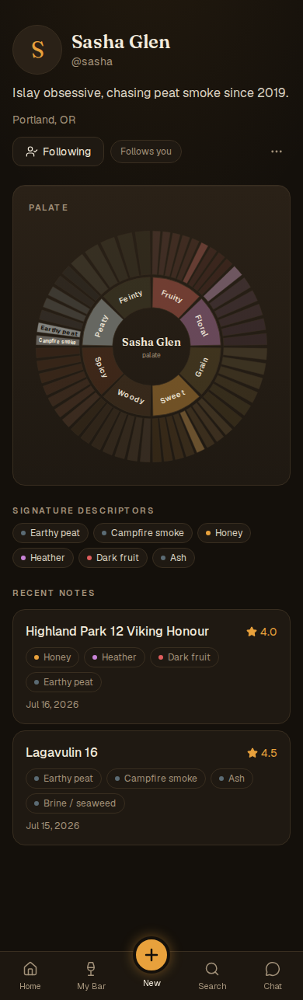
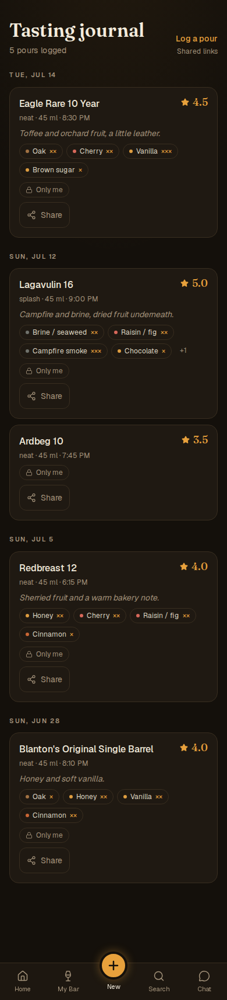
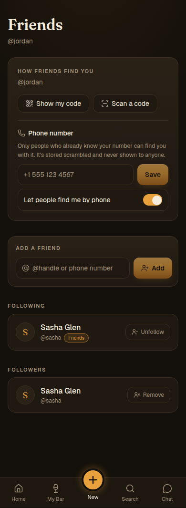
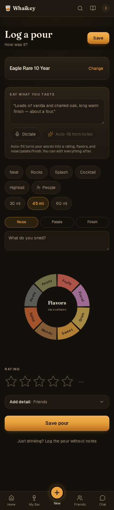
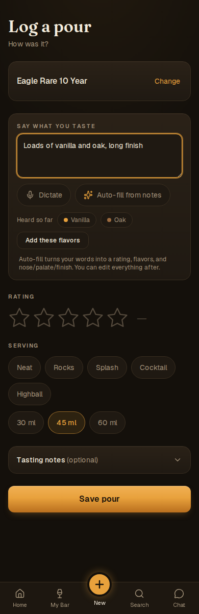
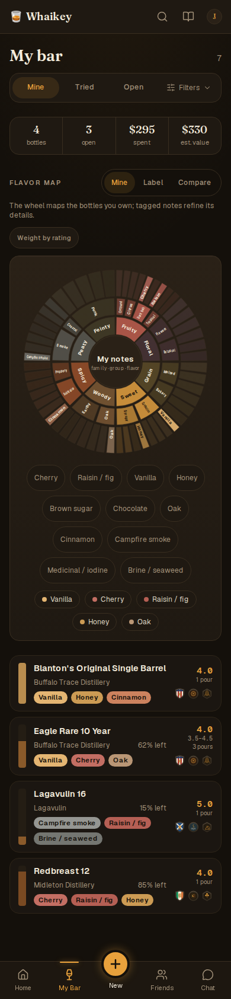
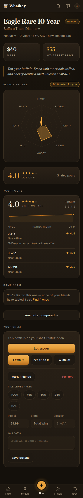

# UX refinement brief — owner notes, round 3 (2026-09-03)

**For the implementing agent.** This is the owner's third pass over the storyboard, turned into decisions and action items with the pictures you need beside them. Read [docs/STORYBOARD.md](../STORYBOARD.md) §0 first (decisions D1–D21 are binding); this brief adds the *why* and the *before/after* for each area. Screenshots on the left are the **live app** (the committed visual baselines under `e2e/__screenshots__/visual-mobile/`); on the right are the **storyboard boards** (`docs/storyboard/`). Where the owner preferred the live app over the board, the brief says so and the board is the one that changes.

Conventions: every item ships with route/component tests and regenerated baselines (DESIGN.md workflow). Finding IDs in brackets point at [docs/REVIEW_2026-09.md](../REVIEW_2026-09.md).

---

## 1. Profile

**Owner:** "Love the integrated look. Friends can be more of a card showing several friends. Sharing and settings could be right below the profile card. This month can be removed. I like the passport section, but no need for the 'next'. Journal pours seems a bit weird — put that after friends and just put the full journal card."

| Live app (`/u/[handle]`) | Storyboard (target) |
|---|---|
|  |  |

**Decisions (D12, D13):** block order is identity row → **palate card** (full two-tier wheel, ring avatar in the centre, description and signature chips beneath) → **Sharing · Settings** row → **Passport** (earned crests only, "View passport →") → **Friends card** (several friends with ring avatars, names, match %) → **Journal card** (one card: count, last pour, "Open journal →"). No "This month" block; no greyed "next" crests.

**Action items**
- [ ] `src/app/u/[handle]/page.tsx`: reorder blocks as above; remove the month-in-review import if any; the public view drops Sharing/Settings.
- [ ] New `<PalateRingAvatar>` component (`src/components/palate-ring-avatar.tsx`): eight equal segments in `flavor-wheel.ts` wedge colours, opacity ∝ family share of `user.palateProfile`, faint track when absent, no ring under 3 rated pours. Use it in the header, comments, friends, feed.
- [ ] Palate card: the existing `FlavorWheel` (display mode) with the avatar absolutely positioned at the centre; description sentence from the palate summary; chips from `signatureLeafIds`.
- [ ] `PassportBadgesSection`: earned crests only on the profile; the "next" logic stays available for `/passport`.
- [ ] Friends card: up to 4 avatars with handle and match chip, "Find people →".
- [ ] Journal card: pour count, last pour name/date/rating, "Open journal →" to `/history`.
- **Acceptance:** profile fits in ~2 viewports; no "This month"; no greyed crests; Sharing and Settings visible directly under the palate card.

---

## 2. Tasting journal — filtering

**Owner:** approved as specified.

| Live app (`/history`) | Storyboard (target, filtered by bottle) |
|---|---|
|  |  |

**Decision (D9):** keep the existing card design; add the filter line (Bottle · Rating · Month · Visibility) with `?bottleId=` pre-selecting a clearable chip; per-row ⋯ (Edit · Share link · Visibility · Delete with undo); remove the stacked visibility chip + Share button from the card body; keep a quiet "Shared with friends" label when not private.

**Action items**
- [ ] `src/app/history/page.tsx` + `history-timeline.tsx`: filter line; read `bottleId`, `rating`, `month`, `visibility` from search params; `listPours` gains the extra filters.
- [ ] Row ⋯ menu wired to `PATCH`/`DELETE /api/pours/[id]` [UX-5]; Edit opens the pour sheet prefilled; Delete → toast with Undo.
- [ ] Deep links: bottle page "All N pours →", Bar row pour count, profile Journal card.

---

## 3. Bottle card — the ⋯ menu

**Owner:** "bottle card refinements — ⋯ menu."

**Decision (D14):** the bottle breakdown card (§3.4 of the storyboard) keeps three visible actions (Log a pour · Add to bar / On shelf · Wishlist) and moves everything else behind a **⋯** in the card's corner: Edit shelf details · Mark finished · Remove from bar · Share bottle · Compare · Report a catalog error. On the bottle page the header ⋯ is this same menu.

**Action items**
- [ ] `<BottleBreakdown>` gets a `menu` slot; `shelf-details.tsx` opens as a sheet from "Edit shelf details".
- [ ] Remove from bar confirms with an undo toast [UX-5].

---

## 4. Friends page

**Owner:** "'Find people' and 'How you're found' can be modified. 'Scan a code' moves into a button at the end of the search bar. 'Show my code' is shown in the profile and to the right of the Friends header. 'How you're found' becomes a settings entry on the Friends screen, and is in the profile page too."

| Live app (`/friends`) | Storyboard (target) |
|---|---|
|  |  |

**Decision (D15):** no segmented control. Header: "Friends" · **Show my code** button · a settings (sliders) icon that opens "How you're found" (the existing `DiscoverySettings`). One search field "@handle or phone number" with a **scan-code** button inside its trailing edge. Below: Following / Followers / Requests, then the full friends feed. "Show my code" also appears on the profile (Friends card) and "How you're found" also lives under Profile → Settings → Privacy.

**Action items**
- [ ] `src/app/friends/friends-client.tsx`: remove the tabs; header actions; move `QrScanButton` into the input's trailing slot; `FriendQr` behind "Show my code"; `DiscoverySettings` behind the gear (sheet).
- [ ] Profile Friends card: "Show my code" link; Settings → Privacy: discoverability toggles.

---

## 5. Log a pour sheet

**Owner:** "I like the new sheet. The photo can be integrated up there, and on while you log your pour, pausing after a minute or two. The flavor wheel in the mock-up is off — keep what we have in the app. I don't like pour size as chips — keep today's control, a bit sleeker. Default to allowing friends to see pours. Move the people part; collapse 'who can see this' into a 'more' and add a 'tags' section right beneath pour size with quick tags like campfire, dinner, with friends."

| Live app (`/pour`, rate step) | Storyboard (sheet, filled) |
|---|---|
|  |  |

| Live app (`/pour`, note capture) | Storyboard (sheet, before a bottle) |
|---|---|
|  |  |

**Decisions (D16–D20):**
- **D16 Camera stays live in the bottle slot while you log.** After a bottle is identified the viewfinder shrinks to a thumbnail strip beside the bottle row and keeps running so you can snap the glass or the label; it **pauses automatically after ~2 minutes** (tap to resume). A captured photo attaches to the pour.
- **D17 The flavor wheel is the app's existing `FlavorWheelInput`**, unchanged (tap a wedge → leaves, hold → intensity, drag). The board's wheel drawing is a stand-in and must not be copied.
- **D18 Pour size keeps today's slider**, made sleeker: thinner track, tick labels at 12 px, the value inline in the section label ("Pour size · 45 ml"), no separate headline.
- **D19 Default visibility is Friends.** `userSocialPrefs.defaultPourVisibility` defaults to `friends` for new users (existing users keep their setting); "Who can see this" moves under a **More ▾** disclosure at the bottom of the sheet together with anything rarely changed.
- **D20 Tags replace the People field.** A **Tags** row sits directly under pour size: quick-select chips (Campfire · Dinner · With friends · Tasting · Cocktail hour · Gift · Sample …) plus "+ add". Free-text people/companions move into More ▾ as "With…". Tags are stored on `pours.context.tags: string[]`, are filterable in the journal, and are private data (they never appear in a social projection unless the pour is shared, and even then "with friends" is the only one that reads socially).

**Action items**
- [ ] Sheet component per STORYBOARD §2.2 with the section order bottle → rating → words → N/P/F + wheel → serving → **size (slider)** → **tags** → **More ▾** (who can see · with · notes).
- [ ] `pour-size-picker.tsx`: slimmer track and labels; value in the label.
- [ ] `pourInputSchema` (`src/lib/pours.ts:40`): `context.tags` as `z.array(z.string().max(24)).max(8)`; journal filter by tag.
- [ ] Default visibility: schema default for `defaultPourVisibility` → `friends`; onboarding copy says so; the "Make everything private" reset still flips it to private.
- [ ] Camera: `useScanEngine` exposes `pause()`/`resume()`; auto-pause timer at 120 s; photo capture → `pours.photoUrl` once media storage exists (PLAN.md §4.6); until then keep the capture local and behind a feature flag.
- **Acceptance:** nothing from today's pour page is missing; rating is directly under the bottle; size is a slider; tags row present; visibility default Friends for a new account; sheet returns to origin with an undo toast.

---

## 6. My Bar

**Owner:** "I like the current page better than the recommendation. I like the fill level slimmer. The header and such needs to be a lot more slim — it's like two full scrolls until you get to your bottles. I also like the Pour quick action from the mock-up."

| Live app (`/bar`) | Storyboard (parts to take) |
|---|---|
|  |  |

**Decision (D21):** keep the live page's structure (filter bar, stats, flavor map, list) rather than the board's. Changes: **slim the top** so the first bottle is within the first viewport — stats become one compact line, the flavor map collapses to a one-line summary with "Open flavor map →" (expanding in place or to its own view), the 15-chip legend goes with it; the **fill spine gets slimmer** (3 px); each row gets the board's **Pour** quick action; sort and shelf search from the board are still wanted.

**Action items**
- [ ] `bar-client.tsx`: collapse the flavor-map block by default (persist the choice); compact stats line; sort control + shelf search; `QuickPourButton` per row; `fill-spine.tsx` width 3 px.
- [ ] Reduce `bar/page.tsx` queries per REL-2.9 while here.
- **Acceptance:** first bottle row visible without scrolling on 390×844 with the map collapsed.

---

## 7. Bottle details

**Owner:** "A million times better than the current one. Missing the badges that belong to it. Love the history and the compare, but compare can be cleaned up."

| Live app (`/bottles/[id]`) | Storyboard (target) |
|---|---|
|  |  |

**Decisions:** adopt the board. Add the bottle's **passport crests** (country · region · style, `BottleStamps`) to the breakdown card under the meta line. Keep "Your history" (average, sparkline, last pours, "All N pours →"). **Same Dram / Compare** becomes one clean row: a single sentence ("You vs the label vs 1 friend · 3 shared · 1 blind spot") and "Compare →"; the detailed buckets live on `/bottles/[id]/compare`.

**Action items**
- [ ] `<BottleBreakdown>` includes `BottleStamps` at 34 px.
- [ ] `same-dram.tsx`: compact summary variant for the bottle page.
- [ ] Sources, pairings, description below; `generateMetadata` [REL-6.5].

---

## 8. Order of work for these refinements

1. Pour sheet (§5) — the core experience; includes tags, default visibility, slider, live camera.
2. Bottle breakdown card + bottle page (§3, §7).
3. Journal filters and ⋯ menu (§2).
4. My Bar slimming + Pour action (§6).
5. Profile (§1) and the ring avatar.
6. Friends page (§4).

## 9. Interpretations to confirm in the PR description

- "Bottle card ⋯ menu" was read as the breakdown card's overflow (§3). If the owner meant the Bar row's overflow, add a row ⋯ with Pour · Edit details · Mark finished · Remove.
- Photo capture depends on media storage (PLAN.md §4.6); ship the live camera and auto-pause now, store the photo once storage exists.
- Tags are free-form strings with a curated starter set; no taxonomy yet.
